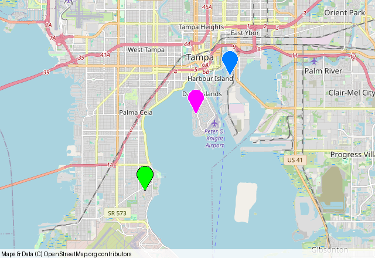
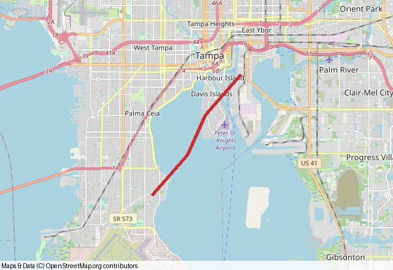
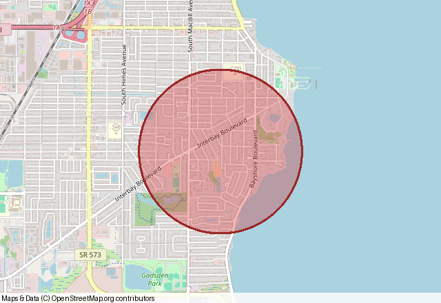

<section class="lf-hero" markdown="1">

Landfall · Python map plotting

# Maps from the data you already have

Turn coordinates, GeoJSON, Shapely shapes, and GeoDataFrames into clear static
maps. Start with a few points, then add routes, boundaries, and layers as your
project grows.

[Make your first map →](getting-started.md){ .lf-button }
[Explore the examples](shapes-and-styling.md){ .lf-button .lf-button--quiet }

</section>

## Find your path

01 · Start here

Build a first map

Install Landfall, learn coordinate order, and save your first Pillow image.

[Open the quick start →](getting-started.md)

02 · Style it

Add shape and meaning

Explore route styling, translucent polygons, circles, color groups, and layers.

[Browse shapes and styling →](shapes-and-styling.md)

03 · Bring your data

Plot geospatial files

Read GeoJSON, reproject GeoDataFrames, or plot Shapely geometry directly.

[Work with geospatial data →](geospatial-data.md)

Need a different basemap? See [how to connect a custom tile service](custom-tile-service.md)
and render it behind Landfall's shapes. For specialized objects or advanced
rendering, see the [py-staticmaps interoperability guide](py-staticmaps.md) to
use the native API directly through `landfall.Context`.

Working with point observations and want geohash or H3 heat layers? See the
[Heatfall documentation](https://heatfall.readthedocs.io/en/latest/index.html)
for gridding, styling, and combining heat cells with Landfall shapes.

## A few things you can make

These examples use real OpenStreetMap tiles and the same public API described
in the guides.

Plot coordinate pairs with a generated palette.

Give a route a clear color and line weight.

Show distance or coverage with a radius in meters.

## Learn by running an example

The examples share a small set of Tampa Bay coordinates, so you can compare
the output while changing one option at a time.

Public API reference

Find function choices, parameter defaults, coordinate rules, and `Context`
methods.

[Look up an option →](api.md)

py-staticmaps interoperability

Use native map objects, tile providers, context controls, and renderers with
Landfall's `Context`.

[Go beyond the helpers →](py-staticmaps.md)

Jupyter notebooks

Run the [points notebook](https://github.com/eddiethedean/landfall/blob/main/examples/plot_points_function.ipynb),
[lines notebook](https://github.com/eddiethedean/landfall/blob/main/examples/plot_lines_function.ipynb),
or [polygons notebook](https://github.com/eddiethedean/landfall/blob/main/examples/plot_polygons_function.ipynb).

Need a hand?

Check common tile, input, and optional dependency issues before opening an issue.

[Troubleshoot a map →](troubleshooting.md)

!!! tip "One coordinate rule to remember"
    Landfall's native points use `(latitude, longitude)`. GeoJSON and Shapely
    use `(longitude, latitude)`; Landfall converts those formats for you.

See the [repository README](https://github.com/eddiethedean/landfall#readme)
for a concise overview and the
[changelog](https://github.com/eddiethedean/landfall/blob/main/CHANGELOG.md)
for release history.
