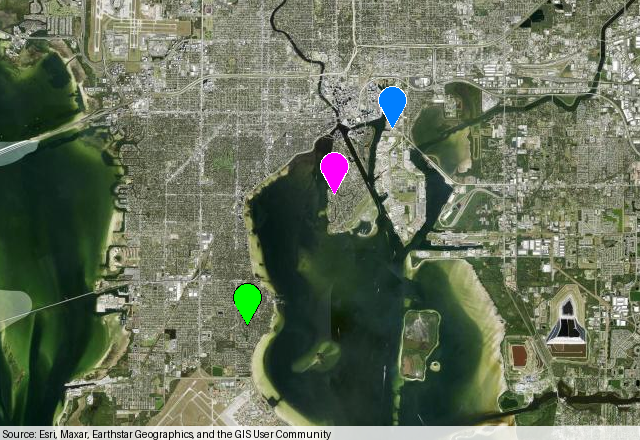

# Use a custom tile service

[Documentation index](README.md) · [Getting started](getting-started.md) · [API reference](api.md)

Landfall accepts a `py-staticmaps` tile provider anywhere you can pass
`tile_provider`. Use this when your maps need an organization’s tile server,
a licensed basemap, or a different style from the default OpenStreetMap map.

!!! tip "You don't need to change how you draw"
    Keep using `plot_points`, `plot_line`, `plot_polygon`, or a `Context` as
    usual. The provider only supplies the background tiles.

## Connect an XYZ tile URL

Most raster tile services use a URL template with zoom, column, and row
coordinates. `py-staticmaps` uses Python `string.Template` placeholders:
`$z` for zoom, `$x` for column, and `$y` for row. This differs from services
that document templates as `{z}/{x}/{y}`; translate those braces to dollar
placeholders when creating the provider.

```python
import landfall
import staticmaps

tiles = staticmaps.TileProvider(
    name="City streets",
    url_pattern="https://tiles.example.org/streets/$z/$x/$y.png",
    attribution="Map data © Example City",
    max_zoom=18,
)

image = landfall.plot_points(
    [(27.88, -82.49), (27.92, -82.46), (27.94, -82.44)],
    colors="distinct",
    point_size=14,
    tile_provider=tiles,
    window_size=(640, 440),
    zoom=-1,
)
image.save("city-map.png")
```

Replace the example hostname, path, attribution, and zoom limit with the values
from your tile service. The provider expects 256-pixel raster tiles and an
XYZ-style URL. When the service uses subdomains, pass them with `shards` and
include `$s` in the URL:

```python
tiles = staticmaps.TileProvider(
    name="Sharded tiles",
    url_pattern="https://$s.tiles.example.org/$z/$x/$y.png",
    shards=["a", "b", "c"],
    attribution="Map data © Example Provider",
    max_zoom=18,
)
```

`max_zoom` is the highest zoom supported by the service. `py-staticmaps`
currently caps providers at zoom 20. If you omit `attribution`, the output
image has no provider credit, so set it to the attribution text required by
your tile service.

## Add a URL-based API key

For a service that authenticates through a query parameter, put `$k` in the
URL template and pass the key as `api_key`. Read the secret from the
environment instead of checking it into a script:

```python
import os

import landfall
import staticmaps

tiles = staticmaps.TileProvider(
    name="Licensed streets",
    url_pattern=(
        "https://tiles.example.org/streets/$z/$x/$y.png?apiKey=$k"
    ),
    attribution="Map data © Example Provider",
    max_zoom=18,
)

image = landfall.plot_points(
    [(27.88, -82.49), (27.92, -82.46)],
    tile_provider=tiles,
    api_key=os.environ["LANDFALL_TILE_API_KEY"],
)
image.save("licensed-map.png")
```

Set `LANDFALL_TILE_API_KEY` in the environment where the script runs, and use
the authentication parameter required by your service. This provider
interface puts the key in the tile URL; it does not configure custom HTTP
headers. Confirm the service allows server-side tile requests and that the
key and usage comply with its terms.

`py-staticmaps` also includes providers that use keys, such as
`staticmaps.tile_provider_StadiaAlidadeSmooth` and
`staticmaps.tile_provider_JawgLight`. Pass their key the same way:

```python
image = landfall.plot_points(
    [(27.88, -82.49), (27.92, -82.46)],
    tile_provider=staticmaps.tile_provider_StadiaAlidadeSmooth,
    api_key=os.environ["STADIA_MAPS_API_KEY"],
)
```

## Render a real custom provider

This complete example builds a provider from an XYZ-style URL and renders the
Tampa Bay points used elsewhere in the guide. It uses Esri World Imagery tiles
as the custom service; the output below was rendered by running this code.

```python
import landfall
import staticmaps

imagery = staticmaps.TileProvider(
    name="Esri World Imagery",
    url_pattern=(
        "https://server.arcgisonline.com/ArcGIS/rest/services/"
        "World_Imagery/MapServer/tile/$z/$y/$x"
    ),
    attribution=(
        "Source: Esri, Maxar, Earthstar Geographics, and the GIS User Community"
    ),
    max_zoom=19,
)

image = landfall.plot_points(
    [(27.88, -82.49), (27.92, -82.46), (27.94, -82.44)],
    colors="distinct",
    point_size=14,
    tile_provider=imagery,
    window_size=(640, 440),
    zoom=-1,
)
image.save("tampa-imagery.png")
```



The Esri tile path places `$y` before `$x`; use the coordinate order specified
by your provider. Here `max_zoom=19` keeps requests within the service's
supported range. Keep the attribution visible when you publish or share the
rendered map, and check [Esri's terms](https://www.esri.com/en-us/legal/terms/full-master-agreement)
and your own provider's terms for current usage requirements.

## Use a provider with a `Context`

For layered maps, set the provider on a context before rendering. This avoids
passing the same provider to separate plotting calls and lets one map combine
points, routes, polygons, and circles:

```python
import os

import landfall
import staticmaps

tiles = staticmaps.TileProvider(
    name="City streets",
    url_pattern="https://tiles.example.org/streets/$z/$x/$y.png",
    attribution="Map data © Example City",
    max_zoom=18,
)

context = landfall.Context()
context.set_tile_provider(tiles, api_key=os.environ.get("LANDFALL_TILE_API_KEY"))
context.add_points([(27.88, -82.49), (27.92, -82.46)], colors="distinct")
context.add_line([(27.88, -82.49), (27.92, -82.46)], color="#d12c31", width=4)
context.render_pillow(640, 440).save("layered-city-map.png")
```

## Troubleshooting

- **Blank tiles:** Open a tile URL directly using known `$z`, `$x`, and `$y`
  values. Check that the URL returns a supported raster image and does not
  require headers the provider interface cannot send.
- **Wrong tiles or repeated rows:** Confirm the service uses XYZ coordinates.
  Some services use TMS row numbering or a different path order; follow the
  service's tile URL documentation.
- **Requests fail at high zoom:** Set `max_zoom` to the actual service limit.
- **No credit on the map:** Set the provider's required attribution text in
  `attribution` and preserve it in published images.

For the provider constructor and built-in providers, see the
[`py-staticmaps` documentation](https://github.com/flopp/py-staticmaps).
