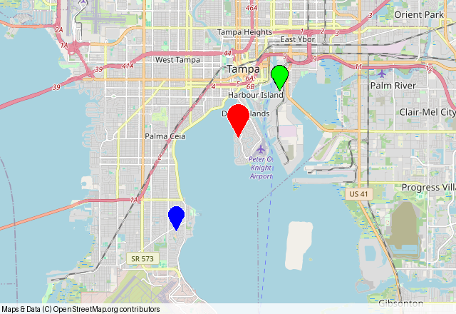

# GeoJSON, Shapely, and GeoPandas

[Documentation index](README.md) · [API reference](api.md)

Landfall reads GeoJSON with its core installation. Shapely and GeoPandas
plotting require the optional extra:

```sh
python -m pip install 'landfall[geo]'
```

These formats use **longitude, latitude** positions. Landfall converts them
to its native latitude/longitude representation. A third altitude coordinate
in GeoJSON is ignored for two-dimensional plotting.

!!! tip "Choose the matching input"
    Use `plot_geojson` for feature dictionaries or files, `plot_geometry` for a
    single Shapely object, and `plot_geodataframe` when the data has columns,
    styles, or a coordinate reference system.

For point observations that you want to group into geohash rectangles or H3
cells, see the [Heatfall point data guide](https://heatfall.readthedocs.io/en/latest/data.html).

## GeoJSON features and files

```python
import landfall

route = [(27.88, -82.49), (27.90, -82.47),
         (27.92, -82.46), (27.94, -82.44)]
feature = {
    "type": "Feature",
    "geometry": {
        "type": "LineString",
        "coordinates": [[lon, lat] for lat, lon in route],
    },
    "properties": {"stroke": "#d12c31", "stroke-width": 5},
}
image = landfall.plot_geojson(feature, window_size=(640, 440), zoom=-1)
image.save("geojson-route.png")
```


`plot_geojson` accepts a Python dictionary or JSON string.
`plot_geojson_file("route.geojson")` reads a UTF-8 file. GeoJSON `Feature`,
`FeatureCollection`, and nested `GeometryCollection` wrappers are supported,
as are Point, MultiPoint, LineString, MultiLineString, Polygon, and
MultiPolygon geometries. Polygon interior rings become transparent holes.
Features with null geometry are skipped; input with no plottable geometries
raises `ValueError`.

Landfall recognizes these feature properties:

| Geometry | Styling properties |
| --- | --- |
| Points | `marker-color` or `color`; `marker-size` |
| Lines | `stroke` or `color`; `stroke-width` |
| Polygons | `stroke`, `stroke-width`, `fill`, `fill-opacity` |

For polygons, `fill-opacity` is a number from 0 to 1. Color extraction also
accepts `fill` as a fallback when no stroke/color property is present.

## GeoDataFrames

GeoPandas support is optional. Install the extra once in the same environment
that runs your plotting code:

```sh
python -m pip install 'landfall[geo]'
```

```python
import geopandas as gpd
from shapely.geometry import Point

frame = gpd.GeoDataFrame(
    {"color": ["blue", "red", "green"], "size": [12, 16, 12]},
    geometry=[
        Point(-82.49, 27.88),
        Point(-82.46, 27.92),
        Point(-82.44, 27.94),
    ],
    crs="EPSG:4326",
)
image = landfall.plot_geodataframe(
    frame,
    color_column="color",
    size_column="size",
    window_size=(640, 440),
    zoom=-1,
)
image.save("geodataframe.png")
```



The selected geometry column is reprojected to WGS84 if it has a CRS.
If it has no CRS, Landfall assumes its coordinates are already longitude and
latitude. `color_column` should contain color names or hex values;
`size_column` should contain integer marker sizes. Use `colors="distinct"`
when you want generated colors instead of a color column, or `colors="red"`
to apply one literal color. Styling follows row order even if the frame index
contains strings or duplicates. Null and empty geometries are skipped along
with their corresponding styles.

!!! warning "Set the CRS before plotting"
    Reprojection is only possible when the selected geometry column has a
    known CRS. Assign its true CRS before calling Landfall; data without a CRS
    is treated as WGS84 longitude/latitude.

## Shapely geometries

```python
from shapely.geometry import Point

point = Point(-82.49, 27.88)
image = landfall.plot_geometry(point, window_size=(640, 440))
image.save("shapely-point.png")
```

`plot_geometries([point, ...], colors="distinct")` draws multiple geometries.
Raw Shapely coordinates must already use WGS84 longitude/latitude values.
Multipart shapes, polygon holes, and geometry collections are preserved.
Null and empty entries are skipped; an entirely empty input raises
`ValueError`.
