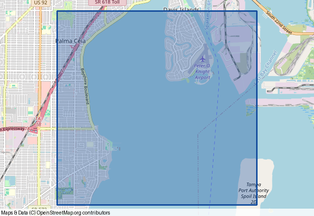
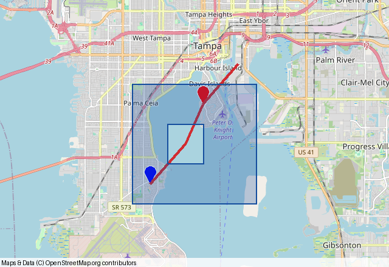

# Shapes and styling

[Documentation index](README.md) · [API reference](api.md)

Each example below uses Landfall's default OpenStreetMap provider. The
checked-in pictures were rendered with real tiles; run
[`examples/generate_doc_maps.py`](https://github.com/eddiethedean/landfall/blob/main/examples/generate_doc_maps.py)
to refresh them. Native coordinate pairs use `(latitude, longitude)`.

```python
import landfall

SIZE = (640, 440)
PLACES = [(27.88, -82.49), (27.92, -82.46), (27.94, -82.44)]
ROUTE = [(27.88, -82.49), (27.90, -82.47),
         (27.92, -82.46), (27.94, -82.44)]
BOUNDARY = [(27.87, -82.50), (27.93, -82.50),
            (27.93, -82.43), (27.87, -82.43)]
```

## Points

Pass `(lat, lon)` pairs or separate latitude and longitude arrays. `point_size`
is measured in pixels. `zoom=-1` shows a little more area around the points.

```python
image = landfall.plot_points(
    PLACES, colors="distinct", point_size=14, window_size=SIZE, zoom=-1
)
image.save("points.png")
```


## Routes

`plot_line` draws a single route; `plot_lines` accepts a sequence of routes.
`width` is measured in pixels.

```python
image = landfall.plot_line(
    ROUTE, color="#d12c31", width=5, window_size=SIZE, zoom=-1
)
image.save("route.png")
```


## Polygons

Landfall closes a native polygon's last edge automatically. A hex color with
eight digits, such as `#154e9e55`, includes an alpha channel for a translucent
fill. Use `Context.add_polygon(..., holes=[...])` for interior rings.

```python
image = landfall.plot_polygon(
    BOUNDARY,
    color="#154e9e",
    fill_color="#154e9e55",
    width=3,
    window_size=SIZE,
)
image.save("polygon.png")
```



## Circles

Radii are meters by default. Pass `radius_unit="kilometers"` if your radius
values are in kilometers. `plot_circles` takes equal-length arrays of
latitudes, longitudes, and radii.

```python
image = landfall.plot_circle(
    27.88, -82.49, 1000,
    color="#9b2727", fill_color="#d12c3155", width=3,
    window_size=SIZE,
)
image.save("circle.png")
```


## Combine shapes and export SVG

`Context` keeps shapes on the same map. Its rendering methods come from
py-staticmaps. This example includes a polygon with a transparent hole.

```python
context = landfall.Context()
context.add_points([27.88, 27.92], [-82.49, -82.46], colors=["blue", "red"])
context.add_line(ROUTE, color="#d12c31", width=4)
context.add_polygon(
    BOUNDARY,
    color="#154e9e",
    fill_color="#154e9e44",
    holes=[
        [(27.89, -82.48), (27.91, -82.48),
         (27.91, -82.46), (27.89, -82.46)]
    ],
)
context.render_pillow(*SIZE).save("layers.png")
context.render_svg(*SIZE).saveas("layers.svg")
```



`Context` also has `add_point`, `add_lines`, `add_polygons`, `add_circle`, and
`add_circles` methods. Set a tile provider or zoom directly on the context
using py-staticmaps methods.

## Colors and groups

Use `color` for one color or `colors` for a batch. Batch `colors` accepts
`"distinct"`, `"random"`, `"wheel"`, one color in a list to broadcast, or one
color per shape. Colors can be names, hex values, RGB/RGBA tuples, or
`staticmaps.Color` instances.

```python
image = landfall.plot_points(
    [27.88, 27.92, 27.94],
    [-82.49, -82.46, -82.44],
    ids=["north", "south", "north"],
    id_colors={"north": "blue", "south": "red"},
)
image.save("grouped.png")
```

`id_colors="distinct"` assigns a generated color to each ID in first-seen
order. An ID mapping takes precedence over `colors` when both are supplied.
Batch polygons and circles also support `fill_colors`, `fill_same`,
`fill_transparency`, and `id_fill_colors`. `fill_transparency` is an alpha
byte from 0 (transparent) to 255 (opaque).

For column-like point data, use `plot_points_data`:

```python
data = {
    "lat": [27.88, 27.92],
    "lon": [-82.49, -82.46],
    "category": ["north", "south"],
}
image = landfall.plot_points_data(
    data, "lat", "lon", ids_name="category", id_colors="distinct"
)
image.save("data-points.png")
```

For more options and defaults, see the [API reference](api.md).
